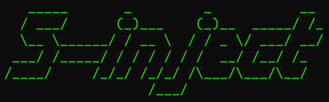
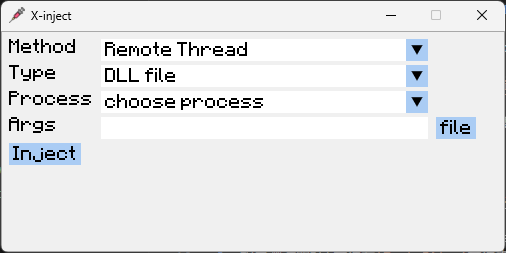
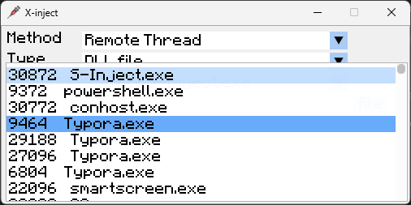
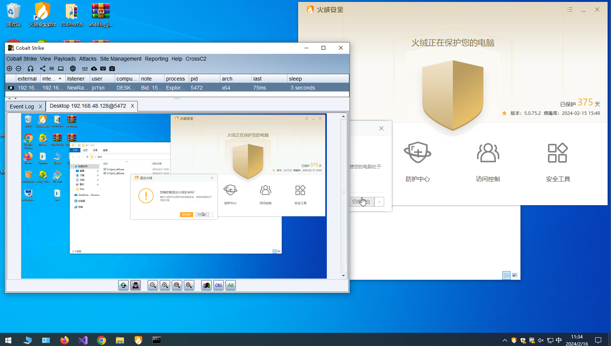

  

<h1><p align="center">S-inject</p></h1>

<p align="center">DLL+Shellcode的Windows注入免杀工具</p>

<p align="center"></p>

只是罗列各种方法，免杀推荐搭配其他技巧，要具体灵活使用

**须知：**

1. 反射式注入参考了著名github项目：https://github.com/stephenfewer/ReflectiveDLLInjection
   该项目为反射式注入支持的DLL
2. Shellcode使用base64编码后的shellcode
3. 相关测试的DLL文件在`Test Files`文件夹中

**免责声明：** 本工具仅供教育和授权测试目的使用。开发者及贡献者不支持、不鼓励也不赞成任何非法或未经授权的使用。 用户有责任确保其使用本工具的行为符合所有适用的法律法规。严禁将本工具用于任何未经授权的活动。 开发者及贡献者对使用本工具造成的任何损害或后果不承担责任。使用前请自行承担风险。 通过使用本工具，您同意这些条款，并对您的行为承担全部责任。

<p align="center"></p>


<p align="center"></p>

# Update

- **[2025-9-15]** 更新终端化操作，添加参数可以快速完成注入，主要新增了读取base64后的shellcode的文件来完成超长shellcode注入。用例见下方Feature的更新描述

- **[2025-9-14]** 更新界面操作逻辑，优化代码结构，更新了imgui，新增 [issue 8](https://github.com/Joe1sn/S-inject/issues/8) 的功能， **该版本暂时不持支纯终端使用**。

  v1.0版本 readme: [README](./doc/version1.0_README.md)

  v2.0版本 readme: [README](./doc/version2.0_README.md)

- **[2025-7-1]** 修改为cmake项目，在项目中新建`build`目录后，使用`cmake ..`后`cmake .. -G "Visual Studio 17 2022" -A x64` 可以生成64位的sln项目，之后使用`cmake --build . --config Release`可以直接编译

# Feature

- **[2025-9-15]** v3.0更新

  `-method`：使用的注入方法

  - `rmtdll`：远程线程注入DLL
  - `refdll`：反射式注入DLL
  - `apcdll`：APC队列注入DLL
  - `net`：从网络加载DLL注入DLL
  - `rmtsc`：远程线程注入Shellcode
  - `apcsc`：APC队列注入Shellcode
  - `ctxsc`：上下文注入Shellcode
  - `rmtfie`：使用含有shellcode的文件进行远程线程注入
  - `apcfile`：使用含有shellcode的文件进行APC队列注入
  - `ctxfile`：使用含有shellcode的文件进行上下文注入

  `-proc`：注入进程的名字

  `-path`：dll的文件路径、dll的url（http开头）、base64后的shellcode、base64后的shellcode文件路径

  `- pid`：进程`PID`

  例如如下命令：使用`远程线程方法`向`x64dbg`进程注入路径为`"D:\Github\S-inject\Test Files\shellcode_x64.txt"`文件中base64后的shellcode

  ```
  S-Inject.exe -method rmtfile -args "D:\Github\S-inject\Test Files\shellcode_x64.txt" -proc x64dbg
  ```

# 免杀效果

远程shellcode注入等功能可免杀火绒，VNC无感，可注册表添加开机自启动





