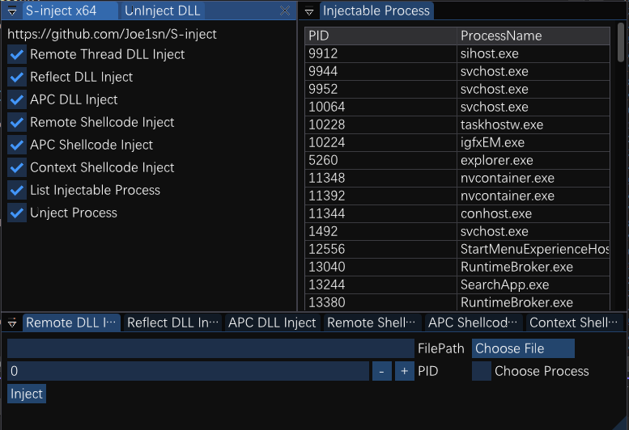
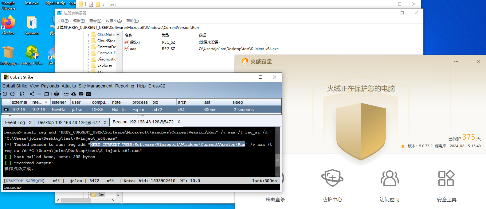

  

<h1>
S-inject
</h1>

DLL+Shellcode的Windows注入免杀工具

只是罗列各种方法，免杀推荐搭配其他技巧，要具体灵活使用

**须知：**

1. 反射式注入参考了著名github项目：https://github.com/stephenfewer/ReflectiveDLLInjection
   该项目为反射式注入支持的DLL
2. Shellcode使用base64编码后的shellcode
3. 相关测试的DLL文件在`Test Files`文件夹中

**免责声明：** 本工具仅供教育和授权测试目的使用。开发者及贡献者不支持、不鼓励也不赞成任何非法或未经授权的使用。 用户有责任确保其使用本工具的行为符合所有适用的法律法规。严禁将本工具用于任何未经授权的活动。 开发者及贡献者对使用本工具造成的任何损害或后果不承担责任。使用前请自行承担风险。 通过使用本工具，您同意这些条款，并对您的行为承担全部责任。

# Update

- **[2024-3-8]** 更新64位`CreateRemoteThread`为直接系统调用，方法采用`SysWhispers3`项目

- **[2024-4-1]** 更新DLL的暴力注入，详细见readme->使用->DLL自动注入/暴力注入

- **[2024-5-16]** 更新远程线程注入，让取消DLL注入更加便捷，便于第二次注入

- **[2024-5-24]**  **更新GUI图形化界面**，之前版本只保留原始二进制文件。貌似之前就被defender识别到了....

- **[2024-6-6]** 
1. 更好的GUI布局，支持Docking。
  2. 代码整理，优化项目文件结构，尽量贴合我认为（~~知道~~）的现代cpp规范。
  3. 遍历部分使用 `NtQuerySystemInformation`  （虽然会导致快速刷新）
  
- **[2024-6-18]** 修复选择进程和遍历进程快速闪烁的问题。修复后需要重新开打功能才能看到新的进程。

# New Feature

- [2024-6-6] V2.1更新

  1. Docking，拖拽可以重新排版

     
     
  2. ImGUI窗口排版通过`imgui.ini`保存，可参考我的排版（ini文件位于bin中，使用时放于同一目录下）
  
     

# 免杀效果

远程shellcode注入等功能可免杀火绒，VNC无感，可注册表添加开机自启动

# 支持功能

**DLL注入**

- 远程线程注入
- 反射式注入
- APC调度注入

**Shellcode注入**

- 远程线程注入
- APC调度注入
- Context上下文注入

**可注入进程遍历**

# 使用

1.x版本（无图像化界面）使用说明见：`oldREADME.md`

直接勾选对应功能，选择DLL/Shellcode，和对应进程的PID

最后点击`start`开始注入

